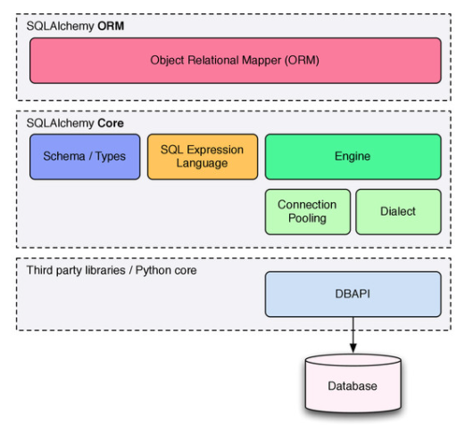

# Intro to SQLAlchemy

## Goal of this training

Get sufficiently interested in SQLAlchemy to learn more about it and start using it!

Duration: approx. 30 minutes

We will be using the SQLAlchemy 2.0 style which is quite different from 1.x.

## Prerequisites

- Python (basic syntax, classes, `with`, venv/poetry)
- Some notions about ORM (object relational mapper)
  - Object: the code manipulates objects
  - Relational: we use a relational db (RDBMS such as MySQL, Postgres)
  - Mapper: we bridge objects and tables
- SQL
- Databases (e.g. MySQL or Postgresql, transactions, connection, etc.)
    - DDL (data definition language with `CREATE`, `ALTER`, etc.) vs. DML (data modification language with `INSERT`, `UPDATE`, `DELETE`).
  - ACID (atomicity, consistency, isolation, durability)

## Intro

SQLAlchemy was started in 2005. While it is often categorized as an ORM, it is much more than that, and its goals are pretty unique in the ORM/db integration space:

    Goals:

    - Provide helpers, tools and components to assist with database development at every level
    - Provide a consistent and fully featured facade over the Python DBAPI
    - Provide an industrial strength, but optional, object relational mapper (ORM)
    - Act as the foundation for any number of third party or in-house tools

Source: [Introduction to SQLAlchemy](https://speakerdeck.com/zzzeek/introduction-to-sqlalchemy-pycon-2013)

### How to approach SQLAlchemy

SQLAlchemy has a relatively steep learning curve. If you try to jump right into the code of somebody pretty experienced with it, you might get lost.

There is no way around it: you have to follow the tutorial from cover to cover. It is very well written and I'm sure you'll learn a ton of things and save you lots of headache.

## Concepts

    SQLAlchemy's philosophies:

    - Bring the usage of different databases and adapters to an interface as consistent as possible...
    - ... but still expose distinct behaviors and features of each backend.
    - Never "hide" the database or its concepts - developers must know/continue to think in SQL...
    - Instead... provide automation and DRY
    - Allow expression of DB/SQL tasks using declarative patterns

Conceptually, most of SQLAlchemy's constructs are based on the book [Patterns of Entreprise Application Architecture](https://martinfowler.com/books/eaa.html) by (you could have guessed it from the title) Martin Fowler. The book describes the following patterns which are re-used in SQLAlchemy:

- Unit of Work
- Metadata Mapping
- Query Object
- Database Session State
- Registry
- Data Mapper

    Core:

    - Engine: a registry which provides connectivity to a particular database server.
    - Dialect: interprets generic SQL and database commands in terms of a specific DBAPI and database backend.
    - Connection Pool: holds a collection of database connections in memory for fast re-use.
    - SQL Expression Language: allows SQL statements to be written using Python expressions.
    - Schema/Types: uses Python objects to represent tables, columns, and datatypes

### SQLAlchemy vs. other ORMs

SQLAlchemy takes a quite different approach from most other ORMs which use some kind of Active Record pattern. SQLAlchemy is often presented by its author Michael Bayer as a "SQL tookit", because it does not try to hide the complexity of integrating with a database from you. This really helps because it means that the abstraction provided by SQLAlchemy don't prevent you from optimizing down to the SQL query.

Compare ActiveRecord:

```ruby
user = User.create(name: "Claire", occupation: "Code Artist")
# return the first user named Claire
claire = User.find_by(name: 'Claire')
```

With SQLAlchemy:

```python
with Session(engine) as session:
    session.add(User(name="Claire", occupation="Code Artist"))
    session.commit()

    claire = session.execute(select(User).filter_by(name="Claire")).scalars().first()
```

The SQLAlchemy example is much more verbose, but also much more transparent about what's actually going on. This is especially the case for managing the transaction, which implicit and hidden from you with the ActiveRecord style (which often uses `AUTOCOMMIT`), while it is explicit (`session.commit()`) with SQLAlchemy.

### SQLAlchemy Core vs. SQLAlchemy ORM



## Tutorial

- [The Engine](https://docs.sqlalchemy.org/en/14/tutorial/engine.html#tutorial-engine)

### Simplest example

See [simplest_example.py](./simplest_example.py)

- Inserting records
- Showing the generated SQL (print the query)

Exercises:

- Writing a SQLAlchemy query. Method: first write it as plain SQL, then write it in Python. You can skip the first step once you have some experience.

### Relationship example

See [simplest_relationship_example.py](./simplest_relationship_example.py)

### What's next?

- SQLAlchemy Core
- Hybrid properties
- Advanced SQL Queries
- Automatic Partitioning
- Automatic Sharding
- write/read replicas
- `association_proxy`

## References

Start with the official doc: https://docs.sqlalchemy.org/

- [Introduction to SQLAlchemy](https://pyvideo.org/pygotham-2014/intro-to-sqlalchemy.html) ([slides](https://speakerdeck.com/zzzeek/introduction-to-sqlalchemy-pycon-2013?slide=6)). It is three hours long but it's probably the most complete introduction by the library author.
- [Hand Coded Applications with SQLAlchemy](https://pyvideo.org/pycon-us-2012/hand-coded-applications-with-sqlalchemy.html) ([slides](https://speakerdeck.com/zzzeek/hand-coded-applications-with-sqlalchemy?slide=24)), another great video by Michael Bayer.
- [SQLAlchemy - an Architectural Retrospective](https://speakerdeck.com/zzzeek/sqlalchemy-an-architectural-retrospective), still by Michael Bayer. Explain how to build a SQL query "from the inside out"

For migrations you would use [alembic](https://alembic.sqlalchemy.org/en/latest/)

See also my other references in the [README](../README.md)
